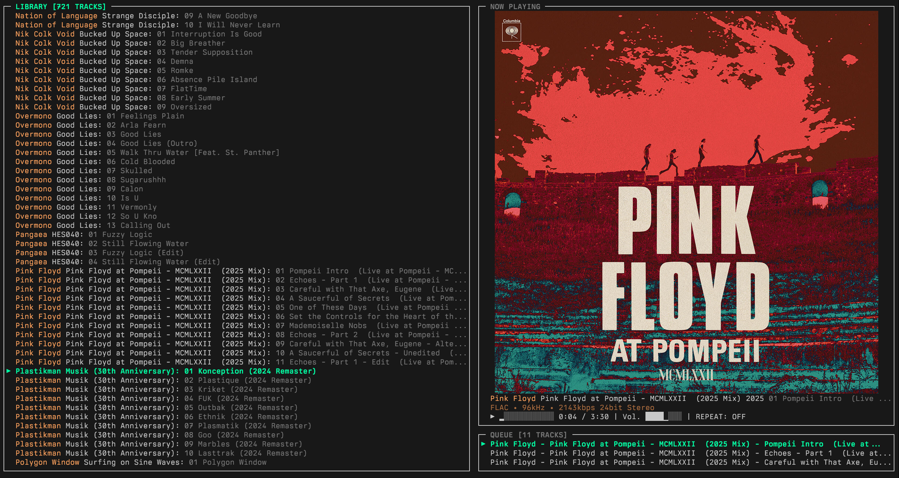
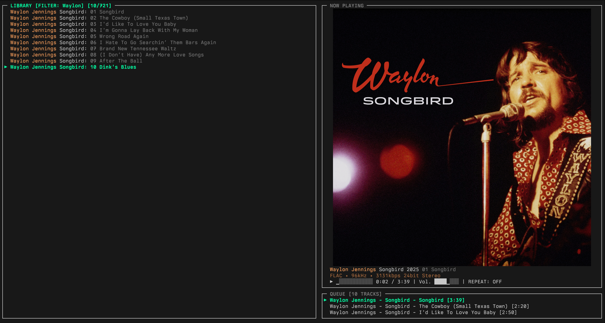

# OUROBOROS, The Eternal Player, v1.0.0

An offline, metadata driven music player built in C++23 for modern Linux Terminals.

OUROBOROS is a production-ready terminal music player for Linux, featuring a **lock-free snapshot architecture** that guarantees deadlock-free operation. With ~10,800 lines of C++23, it delivers 30 FPS rendering, native PipeWire audio, and smart album artwork with shared memory optimization.

**Key Features:**
- **Lock-Free Architecture**: Zero-deadlock snapshot system with atomic reads (UI never blocks)
- **Album Artwork Engine**: Kitty/iTerm2/Sixel protocols with `/dev/shm` shared memory transmission
- **Multi-Format Audio**: MP3, FLAC, OGG/Vorbis, WAV with PipeWire output and per-track format negotiation
- **Intelligent Algorithms**: TimSort (O(n) on sorted data) + Boyer-Moore-Horspool search (sublinear)
- **Modern Terminal UI**: Canvas-based rendering with FlexLayout system and 8 specialized widgets
- **High-Performance Scanning**: Direct `getdents64` syscalls for 2-3x faster directory traversal
- **Content-Addressed Caching**: SHA-256 artwork storage with LRU eviction and async prefetch
- **Event-Driven Design**: Publish-subscribe pattern with background collector threads
- **Test Infrastructure**: Custom C++ test framework with unit and integration tests

## Screenshots

| Main Interface | Album Browser | Search View |
|----------------|---------------|------------|
|  |  |  |

## Build

### Dependencies

- **Compiler**: GCC 13+ or Clang 16+ with C++23 support
- **Build System**: CMake 3.20+, Make
- **Audio Output**: PipeWire (`libpipewire-0.3`, `libspa-0.2`)
- **Audio Codecs**: libmpg123 (MP3), libsndfile (FLAC/WAV), libvorbisfile (OGG)
- **Crypto**: OpenSSL (SHA-256 for artwork hashing)
- **Image Support**: stb_image, stb_image_resize2 (auto-downloaded by CMake)

### Install Dependencies (Arch Linux)

```bash
sudo pacman -S cmake gcc pipewire libpipewire libmpg123 libsndfile libvorbis openssl
```

### Build & Run

```bash
# Configure and build (Release mode)
cmake -B build -DCMAKE_BUILD_TYPE=Release
make -C build -j$(nproc)

# Run from build directory
./build/ouroboros

# Install to /usr/local/bin (optional)
sudo make -C build install
```

### Clean Build

```bash
make distclean  # Removes build/ directory
cmake -B build && make -C build -j$(nproc)
```

### Run Tests

```bash
# Build and run all tests
cmake -B build
cd build && make run_tests

# Run individual test suites
./build/test_utils      # TimSort, BoyerMoore, ArtworkHasher
./build/test_core       # Core utilities
./build/test_pipeline   # Metadata parser integration
```

## Configuration

OUROBOROS reads configuration from: `~/.config/ouroboros/config.toml`

Example configuration:

```toml
[library]
music_directory = "~/Music"
scan_on_startup = true

[ui]
enable_album_art = true
layout = "default"        # default, queue, browser
theme = "dark"            # dark, light, monokai

[playback]
default_volume = 50
shuffle = false
repeat = "all"            # off, one, all

[keybinds]
play = "space"
next = "n"
prev = "p"
quit = "q"
# See docs/keybindings.md for full customization
```

### User Data Locations
- **Config**: `~/.config/ouroboros/config.toml`
- **Artwork Cache**: `~/.cache/ouroboros/artwork.cache` (binary format with SHA-256 keys)
- **Logs**: `/tmp/ouroboros_debug.log`

## Keybindings

### Navigation
- `j` / `k` - Navigate down/up in library
- `↑` / `↓` - Arrow key navigation
- `Shift+j` / `Shift+k` - Multi-select mode (select and navigate)

### Library & Queue
- `Enter` - Add selected/highlighted track(s) to queue
- `Ctrl+f` - Toggle search box
- `Tab` - Switch focus (Browser ↔ Queue)

### Playback
- `Space` - Play/Pause
- `n` - Next track
- `p` - Previous track
- `←` / `→` - Seek backward/forward (±5 seconds)
- `r` - Cycle repeat mode (Off → One → All)

### Volume
- `+` / `=` - Volume up (+5%)
- `-` / `_` - Volume down (-5%)

### Application
- `q` - Quit
- `?` - Toggle help overlay
- `Ctrl+a` - Toggle album grid view
- `Ctrl+C` - Force quit

**Tip:** Press `?` in-app for the full keybindings reference.

## Architecture

### Lock-Free Snapshot System

OUROBOROS achieves **zero deadlocks** through an immutable snapshot architecture:

**Threading Model (4 Threads):**
- **Main Thread**: UI rendering (30 FPS) and input handling
  - Lock-free reads via `publisher->get_current()` (atomic pointer load)
  - Never blocks on mutexes during render
- **LibraryCollector**: Background library scanning, metadata parsing, artwork extraction
- **PlaybackCollector**: Audio decoding, PipeWire output, playback state updates
- **ArtworkLoader**: Async image decoding with sliding window prefetch (20 items ahead/behind)

**Snapshot Pattern:**
- **Immutable State**: Each `Snapshot` is a point-in-time view of `PlayerState`, `LibraryState`, `QueueState`, `UIState`
- **Double Buffering**: Front buffer for reads, back buffer for atomic swap publishing
- **Copy-On-Write**: `shared_ptr` for LibraryState/QueueState (cheap snapshot copies)
- **Sequence Numbers**: Change detection via monotonic `seq` counter

**Audio Pipeline:**
```
File → Format Detection → Decoder (MP3/FLAC/OGG/WAV) → PCM Float Buffer → PipeWire → Speakers
         ↓                     ↓                              ↓
    Extension + Magic       Per-track sample rate       Format negotiation
```

**Library Sorting (Artist → Year → Track):**
- **TimSort**: Adaptive algorithm with O(n) for pre-sorted data, O(n log n) worst case
- **Binary Insertion**: For small runs (<64 elements)
- **Run Detection**: Exploits existing order in real-world music libraries

**Artwork System:**
- **Content-Addressed Storage**: SHA-256 hashing for deduplication
- **Shared Memory Transmission**: Kitty protocol with `/dev/shm` (no Base64 encoding, 33% CPU reduction)
- **Pixel-Perfect Clipping**: Artwork never bleeds over UI borders
- **Surgical Cache Management**: Delete-by-ID when scrolling to prevent stale glitches
- **Smart Prefetch**: LRU cache preloads 20 items ahead/behind viewport + next 5 queue tracks

**Search Algorithm:**
- **Boyer-Moore-Horspool**: Sublinear average case O(n/m) with 256-byte bad-character table
- **Case-Insensitive Mode**: Lowercase normalization without heap allocation
- **Real-Time Filtering**: Updates on every keystroke

## Performance Characteristics

| Operation | Complexity | Notes |
|-----------|------------|-------|
| **Library Scan** | O(n) | Direct `getdents64` syscalls (2-3x faster than `std::filesystem`) |
| **Snapshot Read** | O(1) | Lock-free atomic pointer load |
| **UI Render** | O(widgets) | Only redraws on state change (delta detection) |
| **Sorting** | O(n) – O(n log n) | O(n) for pre-sorted data (TimSort pattern detection) |
| **Search** | O(n/m) avg | Boyer-Moore-Horspool (sublinear on mismatch) |
| **Artwork Load** | Async | Background thread pool with LRU cache |

**Rendering:** Target 30 FPS, actual ~33ms/frame on modern hardware

## Code Statistics

- **Total Lines**: ~10,822 (8,103 implementation + 2,719 headers)
- **Source Files**: 47 `.cpp` files
- **Header Files**: 50 `.hpp` files
- **Audio Decoders**: 4 (MP3, FLAC, OGG, WAV)
- **UI Widgets**: 8 (Browser, Queue, NowPlaying, Controls, StatusBar, SearchBox, AlbumBrowser, HelpOverlay)
- **Background Threads**: 3 (LibraryCollector, PlaybackCollector, ArtworkLoader)
- **Test Files**: 3 suites (unit tests, core tests, integration tests)

## Project Structure

```
ouroboros/
├── src/                      # 47 implementation files (8,103 lines)
│   ├── main.cpp              # Entry point, event loop
│   ├── audio/                # 4 decoders + PipeWire output
│   ├── backend/              # Library, queue, metadata, config, snapshot publisher
│   ├── collectors/           # LibraryCollector, PlaybackCollector threads
│   ├── config/               # Theme and keybind management
│   ├── events/               # EventBus (publish-subscribe)
│   ├── model/                # Snapshot, Track, PlayerState data models
│   ├── ui/                   # Terminal, Canvas, Renderer, widgets, FlexLayout
│   └── util/                 # TimSort, BoyerMoore, DirectoryScanner, Logger, ImageDecoderPool
├── include/                  # 50 header files (2,719 lines) mirroring src/
├── tests/                    # New C++ test framework
│   ├── framework/            # SimpleTest.hpp (custom test runner)
│   ├── unit/                 # TimSort, BoyerMoore, ArtworkHasher tests
│   └── integration/          # Metadata pipeline tests
├── config/                   # Example configuration files
│   └── ouroboros.toml.example
├── vendor/                   # Third-party libraries (stb_image, etc.)
├── CMakeLists.txt            # Build configuration
└── Makefile                  # Convenience wrapper
```

## Troubleshooting

### Album Art Not Displaying

1. **Check Terminal Support**: Kitty graphics protocol required (kitty, WezTerm, Konsole 22.12+)
2. **Verify Config**: Ensure `enable_album_art = true` in `~/.config/ouroboros/config.toml`
3. **Check Artwork**: Verify embedded artwork or sidecar files (cover.jpg, folder.png)
4. **View Logs**: `grep -i artwork /tmp/ouroboros_debug.log`

**Fallback**: Unicode block art renders if Kitty/Sixel unavailable.

### Terminal Doesn't Restore After Crash

**Quick Fix**: Run `reset` or close/reopen terminal.

**Note**: v1.0 includes signal handlers (SIGINT, SIGTERM) to restore terminal state on crashes.

### Build Fails

1. **Check Compiler**: `g++ --version` (need GCC 13+ for C++23)
2. **Verify Dependencies**: `pacman -S cmake gcc pipewire libpipewire libmpg123 libsndfile libvorbis openssl`
3. **Clean Build**: `make distclean && cmake -B build`
4. **CMake Cache**: Delete `build/CMakeCache.txt` if switching compilers

### Playback Issues

1. **PipeWire Running**: `systemctl --user status pipewire`
2. **Audio Sink**: `pactl list sinks short` (ensure default sink exists)
3. **File Format**: Check codec support (`file <audio_file>`)
4. **Logs**: `grep -i playback /tmp/ouroboros_debug.log`

## Testing

### Test Framework

OUROBOROS uses a custom C++ test framework (`tests/framework/SimpleTest.hpp`) with no external dependencies.

**Run All Tests:**
```bash
cmake -B build
cd build && make run_tests
```

**Run Individual Suites:**
```bash
./build/test_utils      # TimSort, BoyerMoore, ArtworkHasher
./build/test_core       # Core utilities
./build/test_pipeline   # Metadata parser integration
```

**Test Macros:**
- `TEST_CASE(name) { ... }` - Define test case
- `ASSERT_TRUE(expr)` - Assert boolean true
- `ASSERT_EQ(a, b)` - Assert equality
- `ASSERT_NEAR(a, b, epsilon)` - Assert floating-point near-equality

## What's Implemented

### ✓ Fully Working
- Multi-format audio playback (MP3, FLAC, OGG, WAV)
- PipeWire output with per-track format negotiation
- Lock-free snapshot system (zero deadlocks)
- Album artwork (Kitty/Sixel/iTerm2 protocols with shared memory)
- Library scanning with metadata extraction and caching
- Boyer-Moore search with real-time filtering
- TimSort library organization (Artist → Year → Track)
- Queue management and playback controls
- Repeat modes (Off, One, All)
- Volume control and seeking
- Terminal UI with 8 widgets and FlexLayout
- Configuration via TOML
- Test infrastructure (unit + integration tests)

### ⚠ Partial/In Progress
- Shuffle mode (flag exists, collector logic needs implementation)
- Album grid view (renders but needs refinement)

### ✗ Not Implemented
- Equalizer/effects
- Advanced visualizations (only progress bar)
- Playlist save/load (removed PlaylistManager)
- Network streaming
- ReplayGain/normalization
- Crossfading/gapless playback

## Dependencies & Credits

Built with:
- **PipeWire** (`libpipewire-0.3`) - Modern Linux audio subsystem
- **libmpg123** - MP3 decoding
- **libsndfile** - FLAC/WAV decoding
- **libvorbisfile** - OGG/Vorbis decoding
- **stb_image** - Image loading (public domain)
- **stb_image_resize2** - Image resizing (public domain)
- **OpenSSL** - SHA-256 hashing for artwork cache

## Development

### Recent Changes (v1.0 "Moria")

**Artwork Engine Rewrite:**
- Shared memory (`/dev/shm`) transmission for Kitty protocol (33% CPU reduction)
- Sliding window prefetch (20 items ahead/behind)
- Pixel-perfect clipping to prevent UI border overflow
- Surgical cache management (delete-by-ID on scroll)

**System Stability:**
- Fixed hanging LibraryCollector thread (replaced blocking sleep with interruptible wait)
- Terminal restoration guaranteed (signal handlers)
- Logging audit (standardized to `ouroboros::util::Logger`)
- Dead code removal (PlaylistManager, FocusManager, legacy tests)

**Test Suite Modernization:**
- Unified C++ test framework (SimpleTest.hpp)
- Wiped legacy shell/Python tests
- Unit tests for algorithms (TimSort, BoyerMoore, ArtworkHasher)
- Integration tests for metadata pipeline

**Search & Find:**
- Decoupled SearchBox from global EventBus
- Browser widget owns search directly
- Fixed input conflicts (typing "q" in search no longer triggers Quit)
- Boyer-Moore-Horspool algorithm implementation

### Contributing

See `COMMIT_MESSAGE.txt` for commit message format. Key areas for contribution:
- Gapless playback implementation
- Shuffle algorithm in PlaybackCollector
- Additional image protocols (Sixel optimization)
- Cross-platform support (macOS, BSD)

---

**Made with C++23** | **Built for Linux** | **Designed for Terminal Enthusiasts** | **v1.0 "Moria" Performance Release**
