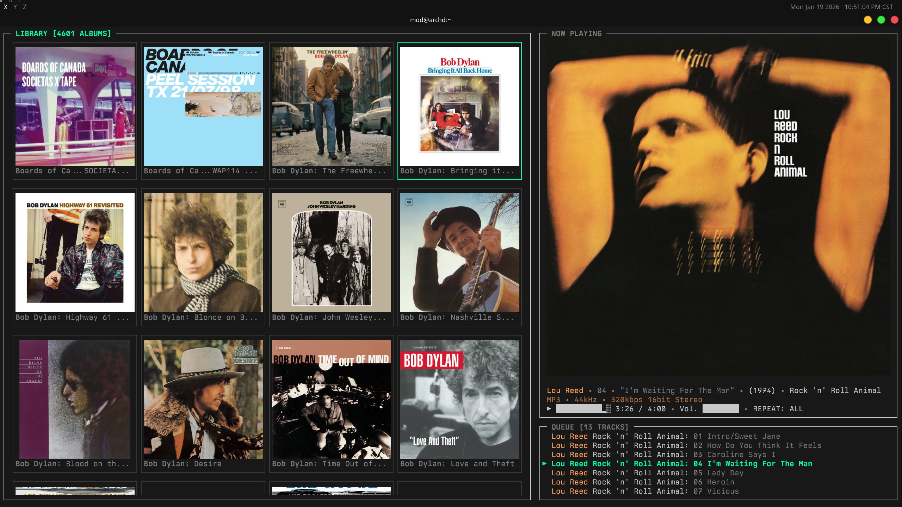
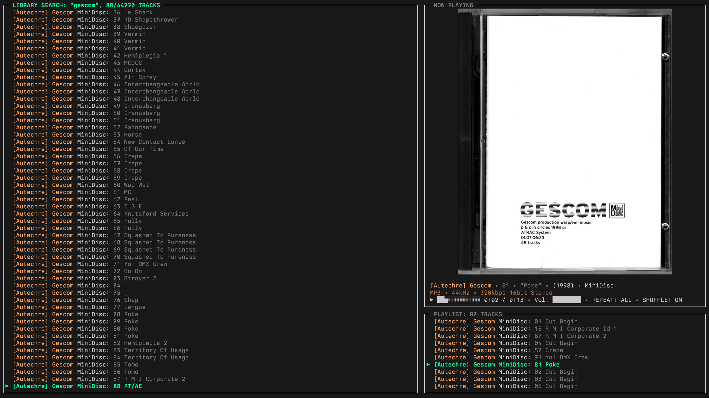
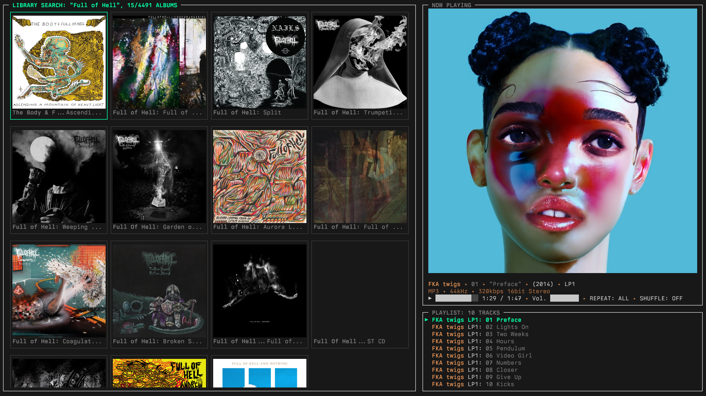

# OUROBOROS, The Eternal Player

An offline, metadata-driven music player built in C++23 for modern Linux Terminals. OUROBOROS is a love letter to era-defining music players and Linux. Featuring a lock-free snapshot architecture that guarantees deadlock-free operation, ~10,800 lines of C++23 deliver 30 FPS rendering, native PipeWire audio, and smart album artwork with shared memory optimization.

**Key Features:**

### Audio System
- **Multi-Format Playback**: MP3 (libmpg123), FLAC/WAV (libsndfile), OGG/Vorbis with full metadata extraction
- **Native PipeWire Integration**: Modern Linux audio with per-track format negotiation (dynamic sample rate/channel reconfiguration)
- **Precision Audio Control**: Millisecond-accurate seeking, software volume control, real-time position tracking

### Terminal Graphics & UI
- **Terminal Support**: Kitty, WezTerm, Konsole, Ghostty, xterm, mlterm, iTerm2. As of December 2025, Kitty is recommended for its performance.
- **Multi-Protocol Album Artwork**: Kitty, Sixel, iTerm2, Unicode blocks with automatic terminal detection and fallback cascade
- **Shared Memory Transmission**: `/dev/shm` for Kitty protocol (33% CPU reduction vs Base64 encoding)
- **9 Specialized Widgets**: Browser, Queue, NowPlaying, Controls, StatusBar, SearchBox, AlbumBrowser, DirectoryBrowser, HelpOverlay
- **Flexbox Layout Engine**: CSS-inspired constraint solver for responsive terminal UI (dynamic sizing, alignment, spacing)
- **Modern Rendering**: Canvas-based with differential updates, 30 FPS target, ANSI escape sequence parsing

### Library Management
- **Kernel-Level Syscalls**: Direct `getdents64` implementation (2-3x faster than std::filesystem)
- **Hardware-Aware Parallelism**: Metadata extraction with 4-16 thread pool (hardware_concurrency)
- **Three-Tier Cache Validation**: O(1) tree hash → O(dirs) dirty detection → O(files) incremental parsing
- **Real-World Performance**: 10K track library scans in <500ms (warm start: 95ms)

### Content-Addressed Artwork
- **SHA-256 Deduplication**: Custom NIST FIPS 180-4 implementation (100 tracks → 1 cached JPEG, 99% space savings)
- **Dual-Hash System**: SHA-256 for content addressing + FNV-1a with adaptive sampling for O(1) runtime lookups
- **Multi-Level Caching**: Disk → memory → decoded pixels (250-entry viewport-aware LRU cache)
- **Radial Rendering**: Distance-based artwork prioritization from cursor position (loads visible items first, then expands outward)
- **Async Decoding Pool**: Parallel image processing with sliding window prefetch (20 items ahead/behind viewport)
- **High-Quality Filtering**: Mitchell-Netrevalli image resizing for photographic content (superior to bilinear/bicubic)
- **Smart Cache Management**: Generation token invalidation, viewport protection, surgical deletion

### Production-Grade Algorithms
- **TimSort**: O(n) best-case sorting exploits natural runs in music libraries (adaptive, stable, galloping merges)
- **Boyer-Moore-Horspool**: Sublinear O(n/m) search with bad-character skip table (2-3x faster than naive, <5ms keystroke latency)
- **Dual-Hash System**: Custom SHA-256 (NIST FIPS 180-4) + FNV-1a with adaptive sampling (>65KB files sampled for speed)

### Lock-Free Concurrency
- **Zero-Deadlock Architecture**: Atomic double-buffering with immutable snapshots (acquire/release memory ordering)
- **UI Never Blocks**: Lock-free reads (<1μs) guarantee smooth 30 FPS rendering on all threads
- **4+ Background Threads**: LibraryCollector, PlaybackCollector, ArtworkLoader, ImageDecoderPool workers
- **Thread-Safe Patterns**: Atomic operations with acquire/release semantics, RAII mutex discipline, zero raw locks

### Unicode & Search
- **Full ICU Integration**: Support for 150+ languages, 1.4M+ characters
- **Diacritic Normalization**: "Björk" → "bjork" for ASCII search on international names
- **Proper Case-Folding**: Handles Turkish İ/i, German ß, etc.
- **Real-Time Filtering**: Boyer-Moore search updates on every keystroke

### Engineering Optimizations
- **~10,800 Lines of C++23**: RAII everywhere, move semantics, smart pointers, zero raw new/delete
- **Memory-Safe Architecture**: Automatic cleanup via destructors, bounds checking, optional returns
- **Custom Test Framework**: SimpleTest.hpp with zero dependencies, unit + integration tests
- **Comprehensive Logging**: Debug/info/warn/error levels, timestamped entries

## Screenshots

### Main Interface: Album View, Large Display


### Main Interface: Album View


### Search: Track View


### Search: Album View



## Installation

### Simple Install

```bash
./install.py
```

### Advanced Install (CMake)

```bash
# Configure
cmake -B build -DCMAKE_BUILD_TYPE=Release

# Build
cmake --build build -j$(nproc)

# Install (optional)
sudo cmake --install build
```

### Other Commands

```bash
./install.py build      # Build only, don't install
./install.py clean      # Clean build directory
./install.py uninstall  # Remove installed binary
./install.py test       # Run tests
./install.py --debug    # Debug build
```

**Then run**: `ouroboros`

**Note**: If you get missing library errors, install the dependencies below first.

---

### Dependencies

- **Compiler**: GCC 13+ or Clang 16+ with C++23 support
- **Build System**: CMake 3.20+, Make
- **Audio Output**: PipeWire (`libpipewire-0.3`, `libspa-0.2`)
- **Audio Codecs**: libmpg123 (MP3), libsndfile (FLAC/WAV), libvorbisfile (OGG)
- **Unicode**: ICU (`icu-uc`, `icu-i18n`) for case-insensitive sorting and diacritic normalization
- **Crypto**: OpenSSL (SHA-256 for content-addressed artwork storage)
- **Image Support**: stb_image, stb_image_resize2 (auto-downloaded by CMake)

### Install Dependencies: Arch Linux

```bash
sudo pacman -S cmake gcc pipewire libpipewire libmpg123 libsndfile libvorbis openssl icu
```

### Install Dependencies: Debian Linux

```bash
sudo apt install pkg-config libpipewire-0.3-dev libmpg123-dev libsndfile1-dev libssl-dev cmake
```

### Run Without Installing

```bash
./install.py build
./build/ouroboros
```

### Run Tests

```bash
# Build and run all tests
cmake -B build
cd build && make run_tests

# Run individual test suites
./build/test_utils      # TimSort, BoyerMoore, ArtworkHasher
./build/test_core       # Core utilities
./build/test_pipeline   # Metadata parser integration
```

## Configuration

OUROBOROS reads configuration from: `~/.config/ouroboros/config.toml`

### Quick Start

Minimal configuration (required):

```toml
[library]
music_directory = "/path/to/your/music"
```

On first run, OUROBOROS will create a default config if none exists.

### Available Settings

**Configuration Categories:**
- `[library]` - Music directory path
- `[playback]` - Default volume, shuffle, repeat mode
- `[ui]` - Layout, theme, album art, sorting preferences
- `[keybinds]` - Fully customizable keybindings

For the complete configuration reference with all options and defaults, see `config/ouroboros.toml.example` in the repository.

### User Data Locations
- **Config**: `~/.config/ouroboros/config.toml`
- **Library Cache**: `~/.cache/ouroboros/library.bin` (CACHE_VERSION 3, binary format)
- **Hierarchical Caches**: `~/.cache/ouroboros/dirs/` (per-directory metadata caches)
- **Artwork Cache**: `~/.cache/ouroboros/artwork.cache` (SHA-256 content-addressed storage)
- **Logs**: `/tmp/ouroboros_debug.log` (timestamped, debug/info/warn/error levels)

## Environment Variables

### Image Protocol Forcing
Override automatic protocol detection:

```bash
# Force Kitty protocol (for testing/troubleshooting)
OUROBOROS_IMAGE_PROTOCOL=kitty ./ouroboros

# Force Sixel (fallback for terminals without Kitty support)
OUROBOROS_IMAGE_PROTOCOL=sixel ./ouroboros

# Force iTerm2 protocol
OUROBOROS_IMAGE_PROTOCOL=iterm2 ./ouroboros

# Disable images entirely (text-only mode)
OUROBOROS_IMAGE_PROTOCOL=none ./ouroboros
```

### Ghostty Performance Optimization
Enable shared memory transmission for Ghostty terminal (experimental):

```bash
OUROBOROS_GHOSTTY_USE_SHM=1 ./ouroboros
```

**Background**: Ghostty has temporary file transmission bugs in older versions, so OUROBOROS defaults to direct transmission (Base64 encoding). Recent Ghostty builds may support shared memory (`/dev/shm`) for Kitty-equivalent performance.

**If you experience rendering glitches**: Remove the environment variable to fall back to safe direct transmission.

## Keybindings

**Press `?` in-app for the complete keybindings reference.** Here are the essentials:

- **Navigation**: `j`/`k` (up/down), `Shift+j`/`Shift+k` (multi-select)
- **Playback**: `Space` (play/pause), `n` (next), `p` (previous), `←`/`→` (seek ±5s)
- **Queue**: `Enter` (add to queue), `Ctrl+d` (clear queue), `Tab` (switch focus)
- **Search**: `Ctrl+f` (toggle search box)
- **Volume**: `+`/`-` (adjust ±5%)
- **Views**: `Ctrl+a` (toggle album grid)
- **Help**: `?` (toggle help overlay), `q` (quit)

All keybindings are customizable via `~/.config/ouroboros/config.toml`

## Troubleshooting

### Album Art Not Displaying

1. **Check Terminal Support**: Kitty graphics protocol required (kitty, WezTerm, Konsole 22.12+)
2. **Verify Config**: Ensure `enable_album_art = true` in `~/.config/ouroboros/config.toml`
3. **Check Artwork**: Verify embedded artwork or sidecar files (cover.jpg, folder.png)
4. **View Logs**: `grep -i artwork /tmp/ouroboros_debug.log`

**Fallback**: Unicode block art renders if Kitty/Sixel unavailable.

### Terminal Doesn't Restore After Crash

**Quick Fix**: Run `reset` or close/reopen terminal.

**Note**: v1.0 includes signal handlers (SIGINT, SIGTERM) to restore terminal state on crashes.

### Build Fails

1. **Check Compiler**: `g++ --version` (need GCC 13+ for C++23)
2. **Verify Dependencies**: `pacman -S cmake gcc pipewire libpipewire libmpg123 libsndfile libvorbis openssl`
3. **Clean Build**: `make distclean && cmake -B build`
4. **CMake Cache**: Delete `build/CMakeCache.txt` if switching compilers

### Playback Issues

1. **PipeWire Running**: `systemctl --user status pipewire`
2. **Audio Sink**: `pactl list sinks short` (ensure default sink exists)
3. **File Format**: Check codec support (`file <audio_file>`)
4. **Logs**: `grep -i playback /tmp/ouroboros_debug.log`

## Testing

### Test Framework

OUROBOROS uses a custom C++ test framework (`tests/framework/SimpleTest.hpp`) with no external dependencies.

**Run All Tests:**
```bash
cmake -B build
cd build && make run_tests
```

**Run Individual Suites:**
```bash
./build/test_utils      # TimSort, BoyerMoore, ArtworkHasher
./build/test_core       # Core utilities
./build/test_pipeline   # Metadata parser integration
```

**Test Macros:**
- `TEST_CASE(name) { ... }` - Define test case
- `ASSERT_TRUE(expr)` - Assert boolean true
- `ASSERT_EQ(a, b)` - Assert equality
- `ASSERT_NEAR(a, b, epsilon)` - Assert floating-point near-equality

## Dependencies & Credits

Built with:
- **PipeWire** (`libpipewire-0.3`) - Modern Linux audio subsystem
- **libmpg123** - MP3 decoding
- **libsndfile** - FLAC/WAV decoding
- **libvorbisfile** - OGG/Vorbis decoding
- **stb_image** - Image loading (public domain)
- **stb_image_resize2** - Image resizing (public domain)
- **OpenSSL** - SHA-256 hashing for artwork cache

## Technical Highlights

- **10,822 lines** of production C++23
- **Lock-free concurrency** with atomic snapshots (zero deadlocks)
- **Kernel-level syscalls** (`getdents64`, `fstatat`, `/dev/shm`)
- **Production algorithms** (TimSort, Boyer-Moore-Horspool, SHA-256)
- **Multi-tier caching** (O(1) → O(dirs) → O(files))
- **Hardware-aware parallelism** (thread pools, async decoding)
- **Full Unicode support** (ICU normalization, 150+ languages)
- **30 FPS rendering** with sub-millisecond snapshot reads

## Technical Documentation

For detailed technical documentation, see **[ARCHITECTURE.md](ARCHITECTURE.md)**:

- **Concurrency Architecture**: Lock-free snapshot system, threading model, atomic operations
- **Algorithm Implementations**: TimSort, Boyer-Moore-Horspool, SHA-256 deep-dives
- **Kernel-Level Optimizations**: Direct syscalls, performance analysis, benchmarks
- **Audio Pipeline**: Format detection, decoders, PipeWire integration
- **Artwork System**: Content addressing, multi-tier caching, async decoding
- **Performance Characteristics**: Complexity analysis, real-world benchmarks
- **Code Quality Patterns**: Memory management, concurrency, error handling
