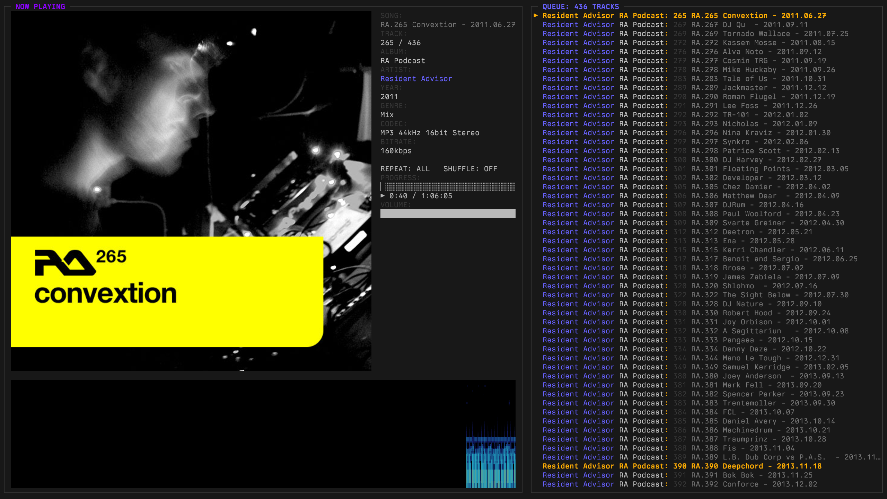
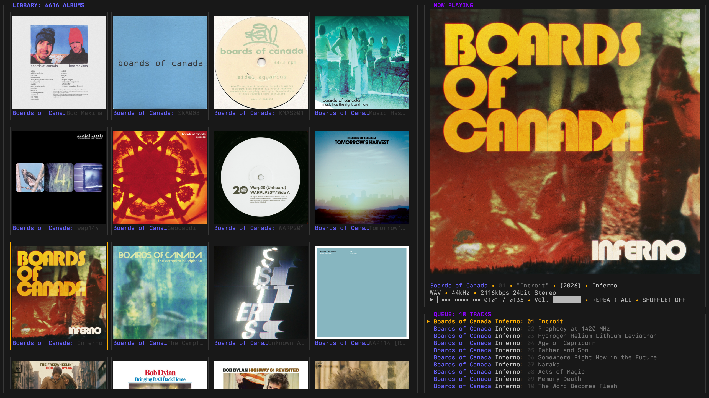
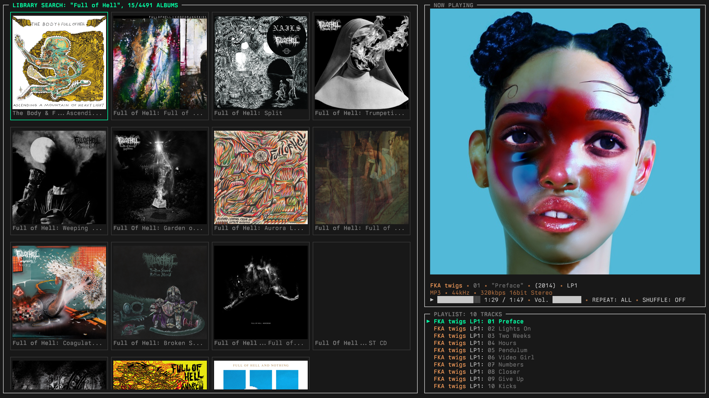

<p align="center">
  
</p>

# OUROBOROS

OUROBOROS is an offline, metadata-driven music player for modern Linux terminals. Written in C++23, OUROBOROS supports MP3, FLAC, WAV, OGG/Vorbis, M4A, AAC and DSD playback formats while utilizing native PipeWire. Seeking is millisecond-accurate, same-format transitions are gapless and Repeat/Shuffle work inside a Two Stacks queue that Previous back tracks thru all prior played files. The player offers both a list or album art grid, search functionality, dedicated panel that displays file artwork beside a navigatable queue. A love letter to era-defining music players and Linux, OUROBOROS is The Eternal Player.

OUROBOROS utilizes sublimation — [montauk](https://github.com/wllclngn/montauk)'s sort, search and order core — compiled in-tree from the sibling checkout rather than vendored. Multi-key library ordering collapses into a single composite byte-order pass over an index permutation, so no track is ever moved by a sort and nothing in shipped code calls `std::sort`. Search is the literal face of sublimation's tri-face matcher, compiled once per query rather than once per track and past 32K tracks it fans out across the same work-stealing pool that drives the parallel sort.

For a comprehensive overview of OUROBOROS' architecture see the documentation here: [ARCHITECTURE.md](ARCHITECTURE.md).

## Screenshots

### Now Playing View: Artwork, Live Spectrogram, Full Queue


`v` gives the cover a full panel on the left and the queue the full height on the right. Under the metadata column the waterfall scrolls one column per frame, each column a 1024-point FFT of the samples PipeWire is about to play. The queue carries its own cursor: `j`/`k` move it, `Enter` jumps playback to it, and `Ctrl+f` narrows it.

### Main Interface: Album View


`Ctrl+a` swaps the track list for a grid of cover art, one tile per album directory. Artwork decodes on background workers and fills in as it lands, so scrolling never waits on a JPEG. Albums whose directory holds several artists are detected as compilations and sort by title rather than by artist.

### Main Interface: Album View, Large Display


The grid reflows to whatever the terminal gives it, and tiles render at the resolution the cells allow rather than at a fixed size. Wider terminals get more columns, not larger padding.

### Search: Album View


`Ctrl+f` opens FIND and the grid narrows on every keystroke. Queries run against ICU-normalized title and artist, so `bjork` reaches `Björk` and `Ctrl+f` costs the same at forty thousand tracks as at four hundred.

## Installation

### Simple Install

```bash
./install.py
```

### Advanced Install (CMake)

```bash
# Configure
cmake -B build -DCMAKE_BUILD_TYPE=Release

# Build
cmake --build build -j$(nproc)

# Install (optional)
sudo cmake --install build
```

### Other Commands

```bash
./install.py build      # Build only, don't install
./install.py clean      # Clean build directory
./install.py uninstall  # Remove installed binary
./install.py test       # Run tests
./install.py --debug    # Debug build
```

**Then run**: `ouroboros`

**Note**: If you get missing library errors, install the dependencies below first.

### Dependencies

- **Compiler**: GCC 13+ or Clang 16+ with C++23 support
- **Build System**: CMake 3.20+, Make
- **Audio Output**: PipeWire (`libpipewire-0.3`, `libspa-0.2`)
- **Audio Codecs**: libmpg123 (MP3), libsndfile (FLAC/WAV), libvorbisfile (OGG), FFmpeg (M4A/AAC, DSF metadata)
- **Unicode**: ICU (`icu-uc`, `icu-i18n`) for case-insensitive sorting and diacritic normalization
- **Image Support**: stb_image, stb_image_resize2 (vendored in vendor/stb/)

### Install Dependencies: Arch Linux

```bash
sudo pacman -S cmake gcc pipewire libpipewire libmpg123 libsndfile libvorbis ffmpeg icu
```

### Install Dependencies: Debian Linux

```bash
sudo apt install pkg-config libpipewire-0.3-dev libmpg123-dev libsndfile1-dev libavformat-dev libavcodec-dev libswresample-dev libicu-dev cmake
```

### Run Without Installing

```bash
./install.py build
./build/ouroboros
```

### Run Tests

Tests are built only in debug builds and run via ctest:

```bash
./install.py --debug    # debug build with the test suite
./install.py test       # build (debug) and run all tests via ctest

# Suites: cache (TIER 0 validation), queue (Two Stacks jump),
# concurrency (ring buffer / seqlock / snapshot), genre (ID3 decode),
# fft (radix-2 transform), sort (sublimation composite-key parity + scale)
```

## Configuration

OUROBOROS reads configuration from: `~/.config/ouroboros/config.toml`

### Quick Start

Minimal configuration (required):

```toml
[library]
music_directories = ["/path/to/your/music"]
```

Multiple directories are supported:

```toml
[library]
music_directories = ["/home/user/Music", "/mnt/external/Albums"]
```

On first run, OUROBOROS will create a default config if none exists.

### Available Settings

**Configuration Categories:**
- `[library]` - Music directories (supports multiple paths)
- `[playback]` - Default volume, shuffle, repeat mode
- `[ui]` - Layout, theme, album art, sorting preferences
- `[keybinds]` - Fully customizable keybindings

For the complete configuration reference with all options and defaults, see `config/ouroboros.toml.example` in the repository.

### User Data Locations
- **Config**: `~/.config/ouroboros/config.toml`
- **Library Cache**: `~/.cache/ouroboros/library.bin` (monolithic binary format)
- **Artwork Cache**: `~/.cache/ouroboros/artwork.cache` (SHA-256 content-addressed storage)
- **Logs**: `/tmp/ouroboros_debug.log` (timestamped, debug/info/warn/error levels)

## Environment Variables

### Image Protocol Forcing
Override automatic protocol detection:

```bash
# Force Kitty protocol (for testing/troubleshooting)
OUROBOROS_IMAGE_PROTOCOL=kitty ./ouroboros

# Force Sixel (fallback for terminals without Kitty support)
OUROBOROS_IMAGE_PROTOCOL=sixel ./ouroboros

# Force iTerm2 protocol
OUROBOROS_IMAGE_PROTOCOL=iterm2 ./ouroboros

# Disable images entirely (text-only mode)
OUROBOROS_IMAGE_PROTOCOL=none ./ouroboros
```

### Ghostty Performance Optimization
Enable shared memory transmission for Ghostty terminal (experimental):

```bash
OUROBOROS_GHOSTTY_USE_SHM=1 ./ouroboros
```

**Background**: Ghostty has temporary file transmission bugs in older versions, so OUROBOROS defaults to direct transmission (Base64 encoding). Recent Ghostty builds may support shared memory (`/dev/shm`) for Kitty-equivalent performance.

**If you experience rendering glitches**: Remove the environment variable to fall back to safe direct transmission.

## Keybindings

**Press `?` in-app for the full help view** — a scrollable reference with keybindings, configuration, troubleshooting, and more. Here are the essentials:

- **Navigation**: `j`/`k` (up/down), `Shift+j`/`Shift+k` (multi-select)
- **Playback**: `Space` (play/pause), `n` (next), `p` (previous), `←`/`→` (seek ±5s)
- **Queue**: `Enter` (add to queue, or jump to album during search; in the queue panel, jump playback to the cursor), `Ctrl+d` (clear queue), `Tab` (switch focus)
- **Search**: `Ctrl+f` (toggle the FIND box; narrows the library, or the queue in the Now Playing view)
- **Volume**: `+`/`-` (adjust ±5%)
- **Modes**: `r` (cycle repeat), `s` (toggle shuffle)
- **Views**: `Ctrl+a` (toggle album grid), `v` (toggle Now Playing view)
- **Help**: `?` (toggle help view, scrollable with `j`/`k`), `q` (quit)

All keybindings are customizable via `~/.config/ouroboros/config.toml`

## Troubleshooting

### Album Art Not Displaying

1. **Check Terminal Support**: Kitty graphics protocol required (kitty, WezTerm, Konsole 22.12+)
2. **Verify Config**: Ensure `enable_album_art = true` in `~/.config/ouroboros/config.toml`
3. **Check Artwork**: Verify embedded artwork or sidecar files (cover.jpg, folder.png)
4. **View Logs**: `grep -i artwork /tmp/ouroboros_debug.log`

**Fallback**: Unicode block art renders if Kitty/Sixel unavailable.

### Terminal Doesn't Restore After Crash

**Quick Fix**: Run `reset` or close/reopen terminal.

**Note**: OUROBOROS installs SIGINT and SIGTERM handlers that restore terminal state on exit, so this should be rare.

### Build Fails

1. **Check Compiler**: `g++ --version` (need GCC 13+ for C++23)
2. **Verify Dependencies**: `pacman -S cmake gcc pipewire libpipewire libmpg123 libsndfile libvorbis icu`
3. **Clean Build**: `make distclean && cmake -B build`
4. **CMake Cache**: Delete `build/CMakeCache.txt` if switching compilers

### Playback Issues

1. **PipeWire Running**: `systemctl --user status pipewire`
2. **Audio Sink**: `pactl list sinks short` (ensure default sink exists)
3. **File Format**: Check codec support (`file <audio_file>`)
4. **Logs**: `grep -i playback /tmp/ouroboros_debug.log`

## Testing

### Test Framework

OUROBOROS uses a custom C++ test framework (`tests/framework/SimpleTest.hpp`) with no external dependencies. The test targets build only in debug builds and run under ctest.

**Run All Tests:**
```bash
./install.py test       # builds debug + runs ctest
```

**Suites:**
```text
cache         TIER 0 cache validation (membership/mtime/removal)
queue         Two Stacks queue + JumpToQueueIndex re-partition
concurrency   AudioRingBuffer SPSC, SpectroTap seqlock, SnapshotBuffers
genre         ID3 numeric genre decode
fft           radix-2 FFT (impulse/DC/tone/Parseval)
sort          sublimation composite-key parity vs ICU + scale
```

**Test Macros:**
- `TEST_CASE(name) { ... }` - Define test case
- `ASSERT_TRUE(expr)` - Assert boolean true
- `ASSERT_EQ(a, b)` - Assert equality
- `ASSERT_NEAR(a, b, epsilon)` - Assert floating-point near-equality

## Dependencies & Credits

Built with:
- **PipeWire** (`libpipewire-0.3`) - Modern Linux audio subsystem
- **libmpg123** - MP3 decoding
- **libsndfile** - FLAC/WAV decoding
- **libvorbisfile** - OGG/Vorbis decoding
- **FFmpeg** (`libavformat`, `libavcodec`, `libswresample`) - M4A/AAC decoding, DSF metadata extraction
- **stb_image** - Image loading (public domain)
- **stb_image_resize2** - Image resizing (public domain)
